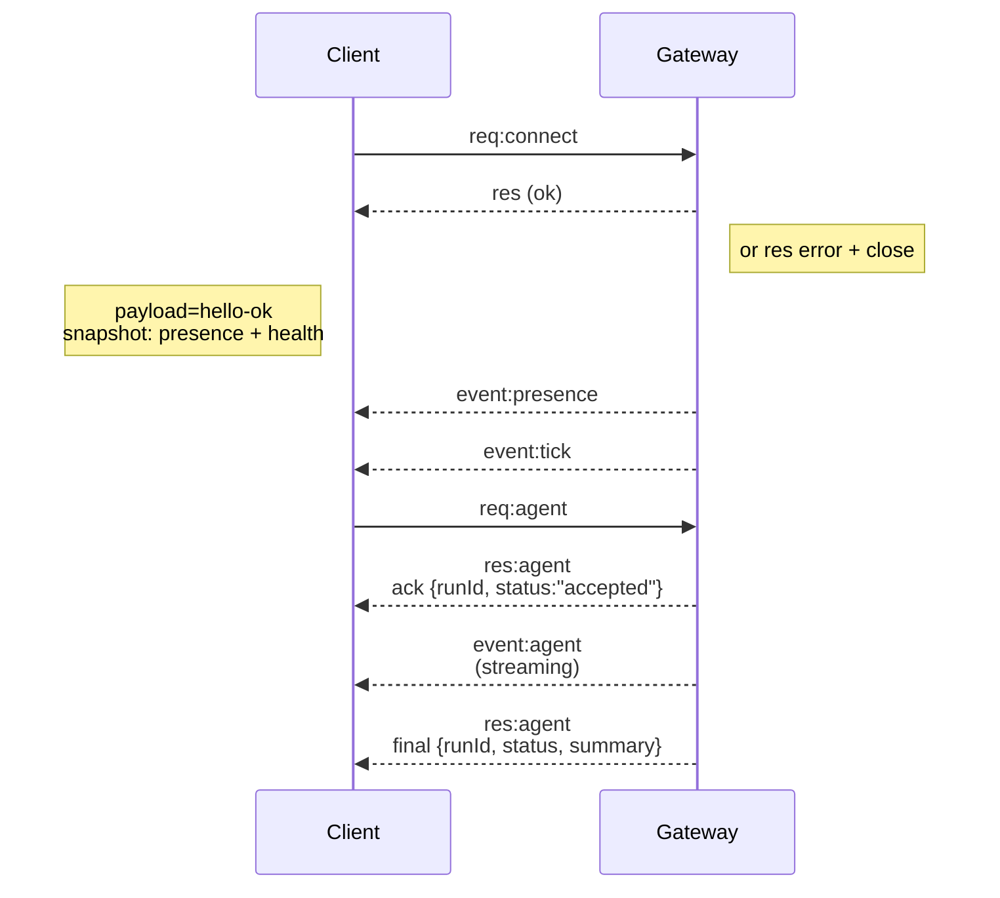

# Gateway architecture

> ## Overview

## 概览

> * A single long-lived **Gateway** owns all messaging surfaces (WhatsApp via Baileys, Telegram via grammY, Slack, Discord, Signal, iMessage, WebChat).
> * Control-plane clients (macOS app, CLI, web UI, automations) connect to the Gateway over **WebSocket** on the configured bind host (default `127.0.0.1:18789`).
> * **Nodes** (macOS/iOS/Android/headless) also connect over **WebSocket**, but declare `role: node` with explicit caps/commands.
> * One Gateway per host; it is the only place that opens a WhatsApp session.
> * The **canvas host** is served by the Gateway HTTP server under:
>   * `/__openclaw__/canvas/` (agent-editable HTML/CSS/JS)
>   * `/__openclaw__/a2ui/` (A2UI host)
>     It uses the same port as the Gateway (default `18789`).

- 一个长期运行的 **Gateway** 持有所有消息通道（WhatsApp 通过 Baileys、Telegram 通过 grammY、Slack、Discord、Signal、iMessage、WebChat）。
- 控制面客户端（macOS App、CLI、web UI、自动化）通过 **WebSocket** 连到 Gateway 配置的绑定主机（默认 `127.0.0.1:18789`）。
- **节点**（macOS / iOS / Android / 无头）也走 **WebSocket** 连，但在 `connect` 里声明 `role: node`，带显式的 caps / commands。
- 一台主机只跑一个 Gateway；它是唯一打开 WhatsApp 会话的地方。
- **canvas 宿主**由 Gateway HTTP 服务器对外提供：
  - `/__openclaw__/canvas/`（agent 可编辑的 HTML/CSS/JS）
  - `/__openclaw__/a2ui/`（A2UI 宿主）
    端口跟 Gateway 一样（默认 `18789`）。

---

> ## Components and flows

## 组件和流程

> ### Gateway (daemon)

### Gateway（后台进程）

> * Maintains provider connections.
> * Exposes a typed WS API (requests, responses, server-push events).
> * Validates inbound frames against JSON Schema.
> * Emits events like `agent`, `chat`, `presence`, `health`, `heartbeat`, `cron`.

- 维护各 provider 的连接。
- 对外暴露带类型的 WebSocket API（请求、响应、服务端推送事件）。
- 用 JSON Schema 校验收到的 frame。
- 发出 `agent`、`chat`、`presence`、`health`、`heartbeat`、`cron` 之类的事件。

> ### Clients (mac app / CLI / web admin)

### 客户端（mac App / CLI / web 管理）

> * One WS connection per client.
> * Send requests (`health`, `status`, `send`, `agent`, `system-presence`).
> * Subscribe to events (`tick`, `agent`, `presence`, `shutdown`).

- 每个客户端一个 WebSocket 连接。
- 发请求（`health`、`status`、`send`、`agent`、`system-presence`）。
- 订阅事件（`tick`、`agent`、`presence`、`shutdown`）。

> ### Nodes (macOS / iOS / Android / headless)

### 节点（macOS / iOS / Android / 无头）

> * Connect to the **same WS server** with `role: node`.
> * Provide a device identity in `connect`; pairing is **device-based** (role `node`) and approval lives in the device pairing store.
> * Expose commands like `canvas.*`, `camera.*`, `screen.record`, `location.get`.

- 连到**同一个 WebSocket 服务器**，`role` 写 `node`。
- 在 `connect` 里带设备身份；配对是**按设备**（role `node`）做的，批准存放在设备配对存储里。
- 对外提供 `canvas.*`、`camera.*`、`screen.record`、`location.get` 之类的命令。

> Protocol details:
>
> * [Gateway protocol](/gateway/protocol)

协议细节：

- [Gateway 协议](/gateway/protocol)

> ### WebChat

### WebChat

> * Static UI that uses the Gateway WS API for chat history and sends.
> * In remote setups, connects through the same SSH/Tailscale tunnel as other clients.

- 静态 UI，通过 Gateway WebSocket API 拿聊天历史和发送消息。
- 远程部署时，和其他客户端走同一条 SSH / Tailscale 隧道。

---

> ## Connection lifecycle (single client)

## 连接生命周期（单客户端）

> ```mermaid
> sequenceDiagram
>     participant Client
>     participant Gateway
>
>     Client->>Gateway: req:connect
>     Gateway-->>Client: res (ok)
>     Note right of Gateway: or res error + close
>     Note left of Client: payload=hello-ok<br>snapshot: presence + health
>
>     Gateway-->>Client: event:presence
>     Gateway-->>Client: event:tick
>
>     Client->>Gateway: req:agent
>     Gateway-->>Client: res:agent<br>ack {runId, status:"accepted"}
>     Gateway-->>Client: event:agent<br>(streaming)
>     Gateway-->>Client: res:agent<br>final {runId, status, summary}
> ```



---

> ## Wire protocol (summary)

## Wire 协议（概要）

> * Transport: WebSocket, text frames with JSON payloads.
> * First frame **must** be `connect`.
> * After handshake:
>   * Requests: `{type:"req", id, method, params}` → `{type:"res", id, ok, payload|error}`
>   * Events: `{type:"event", event, payload, seq?, stateVersion?}`
> * `hello-ok.features.methods` / `events` are discovery metadata, not a generated dump of every callable helper route.
> * Shared-secret auth uses `connect.params.auth.token` or `connect.params.auth.password`, depending on the configured gateway auth mode.
> * Identity-bearing modes such as Tailscale Serve (`gateway.auth.allowTailscale: true`) or non-loopback `gateway.auth.mode: "trusted-proxy"` satisfy auth from request headers instead of `connect.params.auth.*`.
> * Private-ingress `gateway.auth.mode: "none"` disables shared-secret auth entirely; keep that mode off public/untrusted ingress.
> * Idempotency keys are required for side-effecting methods (`send`, `agent`) to safely retry; the server keeps a short-lived dedupe cache.
> * Nodes must include `role: "node"` plus caps/commands/permissions in `connect`.

- 传输：WebSocket，文本 frame，JSON 载荷。
- 第一个 frame **必须**是 `connect`。
- 握手之后：
  - 请求：`{type:"req", id, method, params}` → `{type:"res", id, ok, payload|error}`
  - 事件：`{type:"event", event, payload, seq?, stateVersion?}`
- `hello-ok.features.methods` / `events` 是发现用的元数据，不是把每条可调用 helper 路由都倒出来。
- 共享密钥认证用 `connect.params.auth.token` 或 `connect.params.auth.password`，具体看 Gateway 配的认证模式。
- 带身份的模式比如 Tailscale Serve（`gateway.auth.allowTailscale: true`）或非回环的 `gateway.auth.mode: "trusted-proxy"`，从请求头拿身份满足认证，不用 `connect.params.auth.*`。
- 私网入口下 `gateway.auth.mode: "none"` 完全关闭共享密钥认证；这个模式不要用在公网或不受信入口上。
- 有副作用的方法（`send`、`agent`）必须带幂等 key 才能安全重试；服务端维护一个短期去重缓存。
- 节点在 `connect` 里必须带 `role: "node"` 加 caps / commands / permissions。

---

> ## Pairing + local trust

## 配对 + 本地信任

> * All WS clients (operators + nodes) include a **device identity** on `connect`.
> * New device IDs require pairing approval; the Gateway issues a **device token** for subsequent connects.
> * Direct local loopback connects can be auto-approved to keep same-host UX smooth.
> * OpenClaw also has a narrow backend/container-local self-connect path for trusted shared-secret helper flows.
> * Tailnet and LAN connects, including same-host tailnet binds, still require explicit pairing approval.
> * All connects must sign the `connect.challenge` nonce.
> * Signature payload `v3` also binds `platform` + `deviceFamily`; the gateway pins paired metadata on reconnect and requires repair pairing for metadata changes.
> * **Non-local** connects still require explicit approval.
> * Gateway auth (`gateway.auth.*`) still applies to **all** connections, local or remote.

- 所有 WebSocket 客户端（操作者 + 节点）在 `connect` 里都要带 **设备身份**。
- 新设备 ID 要走配对批准；Gateway 之后给它发一个**设备 token** 用于后续连接。
- 直接本地回环连接可以自动批准，保持同主机用户体验顺畅。
- OpenClaw 还有一条窄的后端 / 容器内 self-connect 路径，用于受信的共享密钥辅助流程。
- Tailnet 和 LAN 连接，包括同主机的 tailnet 绑定，仍然需要显式配对批准。
- 所有连接都必须对 `connect.challenge` nonce 签名。
- 签名载荷 `v3` 还把 `platform` + `deviceFamily` 绑进去；Gateway 在重连时钉住配对元数据，元数据有改动时要走重新配对（repair pairing）。
- **非本地**连接仍然需要显式批准。
- Gateway 认证（`gateway.auth.*`）对**所有**连接都生效，本地或远程都一样。

> Details: [Gateway protocol](/gateway/protocol), [Pairing](/channels/pairing), [Security](/gateway/security).

细节：[Gateway 协议](/gateway/protocol)、[配对](/channels/pairing)、[安全](/gateway/security)。

---

> ## Protocol typing and codegen

## 协议类型和代码生成

> * TypeBox schemas define the protocol.
> * JSON Schema is generated from those schemas.
> * Swift models are generated from the JSON Schema.

- 协议由 TypeBox schema 定义。
- JSON Schema 从 TypeBox schema 生成。
- Swift 模型从 JSON Schema 生成。

---

> ## Remote access

## 远程访问

> * Preferred: Tailscale or VPN.

- 推荐：Tailscale 或 VPN。

> * Alternative: SSH tunnel
>
>   ```bash
>   ssh -N -L 18789:127.0.0.1:18789 user@host
>   ```

- 备选：SSH 隧道

  ```bash
  ssh -N -L 18789:127.0.0.1:18789 user@host
  ```

> * The same handshake + auth token apply over the tunnel.

- 隧道里走的是同一套握手 + auth token。

> * TLS + optional pinning can be enabled for WS in remote setups.

- 远程部署时可以给 WebSocket 启用 TLS + 可选的 pinning。

---

> ## Operations snapshot

## 运维概览

> * Start: `openclaw gateway` (foreground, logs to stdout).
> * Health: `health` over WS (also included in `hello-ok`).
> * Supervision: launchd/systemd for auto-restart.

- 启动：`openclaw gateway`（前台运行，日志打到 stdout）。
- 健康检查：通过 WebSocket 调 `health`（`hello-ok` 里也带）。
- 进程守护：用 launchd / systemd 做自动重启。

---

> ## Invariants

## 不变量

> * Exactly one Gateway controls a single Baileys session per host.
> * Handshake is mandatory; any non-JSON or non-connect first frame is a hard close.
> * Events are not replayed; clients must refresh on gaps.

- 一台主机上有且只有一个 Gateway 控制同一个 Baileys 会话。
- 握手是必须的；第一个 frame 不是 JSON 或不是 connect 就直接断开。
- 事件不会重放；客户端发现 gap 必须自己刷新。

---

> ## Related

## 相关

> * [Agent Loop](/concepts/agent-loop) — detailed agent execution cycle
> * [Gateway Protocol](/gateway/protocol) — WebSocket protocol contract
> * [Queue](/concepts/queue) — command queue and concurrency
> * [Security](/gateway/security) — trust model and hardening

- [Agent 循环](/concepts/agent-loop) —— 详细的 agent 执行周期
- [Gateway 协议](/gateway/protocol) —— WebSocket 协议契约
- [队列](/concepts/queue) —— 命令队列和并发
- [安全](/gateway/security) —— 信任模型和加固
