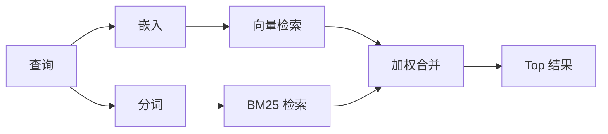

# Memory search

> `memory_search` finds relevant notes from your memory files, even when the
> wording differs from the original text. It works by indexing memory into small
> chunks and searching them using embeddings, keywords, or both.

`memory_search` 能从你的记忆文件里找出相关笔记,哪怕原文用了不同的措辞。它的做法是把记忆切成小分块建索引,然后用嵌入向量、关键字、或两者一起去搜。

## 快速开始

> If you have a GitHub Copilot subscription, OpenAI, Gemini, Voyage, or Mistral
> API key configured, memory search works automatically. To set a provider
> explicitly:

只要你配了 GitHub Copilot 订阅,或者 OpenAI / Gemini / Voyage / Mistral 中任一家的 API key,记忆检索就会自动用上。要显式指定 provider:

```json5
{
  agents: {
    defaults: {
      memorySearch: {
        provider: "openai", // 或 "gemini"、"local"、"ollama" 等
      },
    },
  },
}
```

> For multi-endpoint setups, `provider` can also be a custom
> `models.providers.<id>` entry, such as `ollama-5080`, when that provider sets
> `api: "ollama"` or another embedding adapter owner.

多端点的部署里,`provider` 也可以是 `models.providers.<id>` 自定义条目名,例如 `ollama-5080`,只要那个 provider 把 `api` 设成 `"ollama"` 或别的嵌入适配器宿主。

> For local embeddings with no API key, set `provider: "local"`. Source checkouts
> may still require native build approval: `pnpm approve-builds` then
> `pnpm rebuild node-llama-cpp`.

想完全本地、不用 API key,把 `provider` 设成 `"local"`。从源码 checkout 起步的话,可能还要批准一次原生构建:先 `pnpm approve-builds`,再 `pnpm rebuild node-llama-cpp`。

> Some OpenAI-compatible embedding endpoints require asymmetric labels such as
> `input_type: "query"` for searches and `input_type: "document"` or `"passage"`
> for indexed chunks. Configure those with `memorySearch.queryInputType` and
> `memorySearch.documentInputType`; see the [Memory configuration reference](/reference/memory-config#provider-specific-config).

有些 OpenAI 兼容的嵌入端点要求"查询"和"被索引的分块"用不同标签,比如查询时给 `input_type: "query"`,被索引的分块给 `"document"` 或 `"passage"`。用 `memorySearch.queryInputType` 和 `memorySearch.documentInputType` 配置;细节见 [记忆配置参考](/reference/memory-config#provider-specific-config)。

## 支持的 provider

> | Provider       | ID               | Needs API key | Notes                                                |
> | -------------- | ---------------- | ------------- | ---------------------------------------------------- |
> | Bedrock        | `bedrock`        | No            | Auto-detected when the AWS credential chain resolves |
> | Gemini         | `gemini`         | Yes           | Supports image/audio indexing                        |
> | GitHub Copilot | `github-copilot` | No            | Auto-detected, uses Copilot subscription             |
> | Local          | `local`          | No            | GGUF model, ~0.6 GB download                         |
> | Mistral        | `mistral`        | Yes           | Auto-detected                                        |
> | Ollama         | `ollama`         | No            | Local, must set explicitly                           |
> | OpenAI         | `openai`         | Yes           | Auto-detected, fast                                  |
> | Voyage         | `voyage`         | Yes           | Auto-detected                                        |

| Provider       | ID               | 要 API key | 说明                                          |
| -------------- | ---------------- | ---------- | --------------------------------------------- |
| Bedrock        | `bedrock`        | 否         | AWS 凭证链能解析时自动识别                    |
| Gemini         | `gemini`         | 是         | 支持图片 / 音频索引                           |
| GitHub Copilot | `github-copilot` | 否         | 自动识别,走 Copilot 订阅                      |
| Local          | `local`          | 否         | GGUF 模型,~0.6 GB 下载                        |
| Mistral        | `mistral`        | 是         | 自动识别                                      |
| Ollama         | `ollama`         | 否         | 本地,必须显式指定                             |
| OpenAI         | `openai`         | 是         | 自动识别,速度快                               |
| Voyage         | `voyage`         | 是         | 自动识别                                      |

## 检索怎么工作的

> OpenClaw runs two retrieval paths in parallel and merges the results:

OpenClaw 并行跑两条检索路径,然后把结果合起来:



> - **Vector search** finds notes with similar meaning ("gateway host" matches
>   "the machine running OpenClaw").
> - **BM25 keyword search** finds exact matches (IDs, error strings, config
>   keys).

- **向量检索** 找"语义相近"的笔记("gateway host" 能匹配 "跑 OpenClaw 的那台机器")。
- **BM25 关键字检索** 找"字面精确"的匹配(ID、报错字符串、配置 key)。

> If only one path is available (no embeddings or no FTS), the other runs alone.

只有一条路径可用时(没嵌入,或者没全文索引),另一条单独跑。

> When embeddings are unavailable, OpenClaw still uses lexical ranking over FTS results instead of falling back to raw exact-match ordering only. That degraded mode boosts chunks with stronger query-term coverage and relevant file paths, which keeps recall useful even without `sqlite-vec` or an embedding provider.

嵌入不可用时,OpenClaw 仍在全文索引结果上做词法排序,不会退化成"只按字面精确匹配"的原始顺序。降级模式下,查询词覆盖度更高、文件路径更相关的分块会被加权,所以即便没装 `sqlite-vec` 或没配嵌入 provider,召回也还有用。

## 提升检索质量

> Two optional features help when you have a large note history:

有两个可选特性,在你笔记积累很多之后能帮上忙:

### 时间衰减

> Old notes gradually lose ranking weight so recent information surfaces first.
> With the default half-life of 30 days, a note from last month scores at 50% of
> its original weight. Evergreen files like `MEMORY.md` are never decayed.

旧笔记的排序权重会慢慢减少,让新信息先冒头。默认半衰期 30 天,所以上个月写的一条笔记现在只剩原始权重的 50%。`MEMORY.md` 这种长青文件永远不衰减。

> <Tip>
> Enable temporal decay if your agent has months of daily notes and stale
> information keeps outranking recent context.
> </Tip>

[展开: 提示] 你的 agent 累积了几个月的日笔记、而过期信息老是压过最近上下文,就开时间衰减。

### MMR(结果多样性)

> Reduces redundant results. If five notes all mention the same router config, MMR
> ensures the top results cover different topics instead of repeating.

减少冗余结果。五条笔记都提到同一份路由配置时,MMR 让 Top 结果覆盖不同话题,而不是重复同一个。

> <Tip>
> Enable MMR if `memory_search` keeps returning near-duplicate snippets from
> different daily notes.
> </Tip>

[展开: 提示] `memory_search` 老是从不同日笔记里返回几乎相同的片段,就开 MMR。

### 两个一起开

```json5
{
  agents: {
    defaults: {
      memorySearch: {
        query: {
          hybrid: {
            mmr: { enabled: true },
            temporalDecay: { enabled: true },
          },
        },
      },
    },
  },
}
```

## 多模态记忆

> With Gemini Embedding 2, you can index images and audio files alongside
> Markdown. Search queries remain text, but they match against visual and audio
> content. See the [Memory configuration reference](/reference/memory-config) for
> setup.

用 Gemini Embedding 2,你能把图片和音频文件跟 Markdown 一起索引。检索查询本身还是文本,但能匹配到视觉和音频内容。怎么配见 [记忆配置参考](/reference/memory-config)。

## 会话记忆检索

> You can optionally index session transcripts so `memory_search` can recall
> earlier conversations. This is opt-in via
> `memorySearch.experimental.sessionMemory`. See the
> [configuration reference](/reference/memory-config) for details.

你可以把会话对话记录也索引上,让 `memory_search` 能召回早先的对话。这是可选项,用 `memorySearch.experimental.sessionMemory` 开。细节见 [配置参考](/reference/memory-config)。

## 排障

> **No results?** Run `openclaw memory status` to check the index. If empty, run
> `openclaw memory index --force`.

**搜不到结果?** 跑 `openclaw memory status` 看索引状态。空的话,跑 `openclaw memory index --force`。

> **Only keyword matches?** Your embedding provider may not be configured. Check
> `openclaw memory status --deep`.

**只有关键字匹配?** 大概率是嵌入 provider 没配上。看 `openclaw memory status --deep`。

> **Local embeddings time out?** `ollama`, `lmstudio`, and `local` use a longer
> inline batch timeout by default. If the host is simply slow, set
> `agents.defaults.memorySearch.sync.embeddingBatchTimeoutSeconds` and rerun
> `openclaw memory index --force`.

**本地嵌入超时?** `ollama`、`lmstudio`、`local` 默认用更长的内联批超时。机器就是慢的话,设 `agents.defaults.memorySearch.sync.embeddingBatchTimeoutSeconds`,然后重跑 `openclaw memory index --force`。

> **CJK text not found?** Rebuild the FTS index with
> `openclaw memory index --force`.

**中日韩文搜不到?** 跑 `openclaw memory index --force` 重建全文索引。

## 延伸阅读

> - [Active Memory](/concepts/active-memory) -- sub-agent memory for interactive chat sessions
> - [Memory](/concepts/memory) -- file layout, backends, tools
> - [Memory configuration reference](/reference/memory-config) -- all config knobs

- [Active Memory](/concepts/active-memory) —— 给交互对话用的 sub-agent 记忆
- [记忆](/concepts/memory) —— 文件布局、后端、工具
- [记忆配置参考](/reference/memory-config) —— 全部配置项

## 相关

> - [Memory overview](/concepts/memory)
> - [Active memory](/concepts/active-memory)
> - [Builtin memory engine](/concepts/memory-builtin)

- [记忆总览](/concepts/memory)
- [Active memory](/concepts/active-memory)
- [Builtin memory engine](/concepts/memory-builtin)
